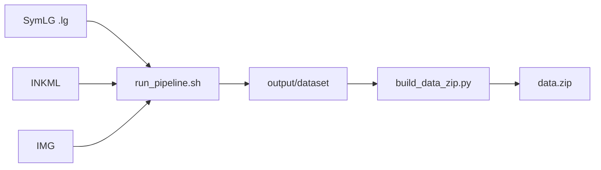

# Preprocessing (TC11 CROHME23 → CoMER)

Convert the [TC11 CROHME23](https://www.cs.rit.edu/~crohme/) dataset into space-tokenized LaTeX labels and PNG images for CoMER training.

## Dataset layout

Point `DATA_ROOT` at the TC11 release (default: `/home/habku/anh_project/TC11_CROHME23`):

```
TC11_CROHME23/
├── INKML/          # stroke XML per sample
├── SymLG/          # symbol relation graphs (.lg)
└── IMG/            # rendered PNGs (folder names may differ from INKML)
    ├── train/
    ├── val/
    └── test/
```

## Pipeline overview (recommended)



The unified pipeline (`paths.py` + `pipeline.py`):

1. Walk all **SymLG** `.lg` files (train / val / test).
2. Map each LG to **IMG** or **INKML** by relative path, then by filename stem (folder names may differ, e.g. `CROHME2023_train` vs `CROHME2013_train`).
3. **Multiprocess**: LG → space-tokenized LaTeX; IMG crop or INKML render → BMP (max side 1000 px).
4. Write `data/train`, `data/val`, `data/2019`, `data/2023` (test years separate, not merged).

| Step | Command | Output |
|------|---------|--------|
| Full preprocess | `bash preprocessing/run_pipeline.sh` | `preprocessing/output/dataset/` |
| Pack for training | `python preprocessing/build_data_zip.py` | `data.zip` (CoMER `config.yaml`) |
| LaTeX stats / vocab | `python preprocessing/analyze_latex.py` | `preprocessing/output/analysis/` |
| Image size stats | `python preprocessing/analyze_images.py` | `preprocessing/output/analysis/image_*` |

Run all commands from the **CoMER repo root**.

### Unified pipeline

```bash
bash preprocessing/run_pipeline.sh
```

```bash
DATA_ROOT=/path/to/TC11_CROHME23 OUT_ROOT=preprocessing/output/dataset WORKERS=8 \
  bash preprocessing/run_pipeline.sh
```

Or directly:

```bash
python preprocessing/pipeline.py \
  --data-root "$DATA_ROOT" \
  --output preprocessing/output/dataset \
  --workers 8
```

Pack into CoMER `data.zip`:

```bash
bash preprocessing/run_build_data_zip.sh
# or: OUT_ZIP=data_2023.zip bash preprocessing/run_build_data_zip.sh
```

On-disk paths match the zip (`data/train`, `data/val`, `data/2019`, `data/2023`). If you have an older run under `train/`, `val/`, `test/2019/`, migrate once:

```bash
python preprocessing/migrate_dataset_layout.py
# or: bash preprocessing/run_build_data_zip.sh  (migrates automatically before zipping)
```

Optional: drop samples with tokens not in `comer/datamodule/dictionary.txt`:

```bash
python preprocessing/build_data_zip.py --dictionary comer/datamodule/dictionary.txt
```

Output layout (matches `comer/datamodule/datamodule.py`):

```
preprocessing/output/dataset/
└── data/
    ├── train/
    ├── val/
    ├── 2019/               # CROHME2019_test
    └── 2023/               # CROHME2023_test
    (each: caption.txt + img/*.bmp)
```

`build_data_zip.py` zips the same paths into `data.zip` (no remapping).

## Legacy steps (optional)

These scripts remain for label-only or image-only runs without the unified pipeline.

## 1. Convert labels (SymLG → LaTeX)

```bash
bash preprocessing/run_convert.sh
```

- Reads `.lg` files under `SymLG/{train,val,test}/`
- Renders space-separated LaTeX (CoMER `caption.txt` format)
- Splits multi-digit numeric labels into single-character tokens (e.g. `918` → `9 1 8`)
- Uses multiprocessing (`WORKERS` = CPU count by default)

```bash
DATA_ROOT=/path/to/TC11_CROHME23 OUT_ROOT=preprocessing/output/lg WORKERS=8 \
  bash preprocessing/run_convert.sh
```

Or directly:

```bash
python preprocessing/convert_labels.py --data-root "$DATA_ROOT" --output preprocessing/output/lg
```

## 2. Export images

```bash
bash preprocessing/run_export_images.sh
```

| Mode | Flag | Behavior |
|------|------|----------|
| Default | — | Copy/crop from `IMG/` when a PNG exists; otherwise render from `INKML` |
| IMG only | `--img-only` | Copy and crop all images from `IMG/` |
| INKML only | `--inkml-only` | Render all images from `INKML/` (no `IMG` lookup) |

### IMG path (`image_crop.py`)

1. Adaptive binarization (black strokes, white background)
2. Crop to equation bounding box + 5 px margin
3. Save as RGB PNG
4. Scale down if `max(width, height) > 1000` px

### INKML path (`inkml_to_image.py`)

1. Translate strokes to origin
2. Normalize mean stroke height to **30** ink units
3. Cap ink extent at **1000** units, then render with matplotlib
4. Scale PNG down to **1000** px max side only when needed

```bash
python preprocessing/export_images.py \
  --data-root "$DATA_ROOT" \
  --output preprocessing/output/img \
  --max-image-size 1000 \
  --workers 8
```

Useful flags: `--no-crop`, `--no-progress`, `--dpi`, `--padding`, `--inkml-only`, `--img-only`.

## 3. Analysis

**LaTeX** (length, vocabulary, token frequencies):

```bash
python preprocessing/analyze_latex.py
# --input preprocessing/output/lg
# --output preprocessing/output/analysis
```

**Images** (width/height distributions, histograms):

```bash
python preprocessing/analyze_images.py
# --input preprocessing/output/img
# --output preprocessing/output/analysis
```

## Output layout

```
preprocessing/output/
├── dataset/data/          # unified pipeline (train, val, 2019, 2023)
├── lg/                    # legacy LaTeX labels (.tex)
├── img/                   # legacy PNG images
└── analysis/
    ├── latex_stats.json
    ├── vocab_*.txt
    ├── token_frequency*.csv
    ├── image_stats.json
    ├── image_sizes.csv
    └── image_plots/
```

`preprocessing/output/` is gitignored.

## Modules

| File | Role |
|------|------|
| `paths.py` | Index `.lg` files; map IMG / INKML by path and stem |
| `pipeline.py` | Multiprocess LG→LaTeX + image export → `caption.txt` |
| `build_data_zip.py` | Pack `output/dataset` → `data.zip` |
| `run_pipeline.sh` | Shell wrapper for unified pipeline |
| `lg_srt.py` | Parse SymLG → symbol relation tree |
| `srt_to_latex.py` | SRT → space-tokenized LaTeX |
| `lg_to_latex.py` | Batch LG conversion |
| `convert_labels.py` | CLI for label conversion |
| `inkml_to_image.py` | Render INKML strokes to PNG |
| `image_crop.py` | Binarize, crop, scale IMG exports |
| `export_images.py` | Batch image export |
| `analyze_latex.py` | LaTeX dataset analysis |
| `analyze_images.py` | Image size analysis |
| `batch_utils.py` | Multiprocessing + tqdm helpers |

## Dependencies

From repo `requirements.txt`:

- `matplotlib`, `Pillow`, `opencv-python`, `tqdm`
- `lxml`, `beautifulsoup4` (optional XML helpers)

```bash
pip install matplotlib Pillow opencv-python tqdm
```

## Tests

```bash
python -m unittest preprocessing.tests.test_lg_to_latex -v
```

## Environment variables

| Variable | Used by | Default |
|----------|---------|---------|
| `DATA_ROOT` | pipeline / legacy scripts | `TC11_CROHME23` path |
| `OUT_ROOT` | shell scripts | `preprocessing/output/dataset` (pipeline) or `lg` / `img` |
| `WORKERS` | shell scripts | CPU count |
