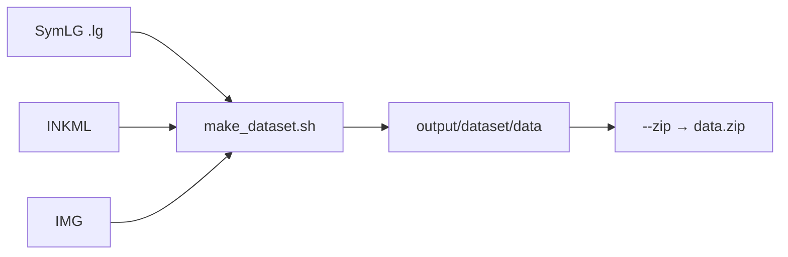

# Preprocessing (TC11 CROHME23 → CoMER)

Convert [TC11 CROHME23](https://www.cs.rit.edu/~crohme/) into CoMER training folders: space-tokenized `caption.txt` plus BMP images (black background, white strokes).

## Quick start

From the **CoMER repo root**:

```bash
# Build dataset (SymLG → LaTeX + IMG/INKML → BMP + caption.txt)
bash preprocessing/make_dataset.sh

# Optional: pack data.zip for config.yaml
bash preprocessing/make_dataset.sh --zip

# Optional: LaTeX vocab + image size reports
bash preprocessing/make_dataset.sh --analyze
```

Set `DATA_ROOT` to your TC11 tree (default: `/home/habku/anh_project/TC11_CROHME23`).

## Input layout

```
TC11_CROHME23/
├── SymLG/     # symbol relation graphs (.lg)
├── INKML/     # stroke XML
└── IMG/       # rendered PNGs
```

## Output layout

```
preprocessing/output/dataset/data/
├── train/   caption.txt + img/*.bmp
├── val/
├── 2019/    CROHME2019 test
└── 2023/    CROHME2023 test
```

Point `config.yaml` at:

```yaml
data:
  train_path: preprocessing/output/dataset/data/train
  val_path: preprocessing/output/dataset/data/val
  test_path: preprocessing/output/dataset/data/2023
```

## Pipeline



`pipeline.py` (via `paths.py`):

1. Walk all SymLG `.lg` files.
2. Match IMG or INKML by relative path, then by filename stem.
3. Convert LG → space-tokenized LaTeX; export BMP (max side 1000 px, CoMER polarity).
4. Write `caption.txt` per split.

Useful flags: `--max-samples N`, `--write-tex`, `--no-crop`, `--workers N`.

## Pack zip

```bash
bash preprocessing/make_dataset.sh --zip
# OUT_ZIP=data_2023.zip bash preprocessing/make_dataset.sh --zip
```

Filter OOV tokens against the model dictionary:

```bash
bash preprocessing/make_dataset.sh --zip --dictionary comer/datamodule/dictionary.txt
```

Legacy folders (`train/`, `val/`, `test/2019/`) are migrated automatically before zipping. Migrate only:

```bash
bash preprocessing/make_dataset.sh --zip --migrate-only
```

## Analysis

```bash
bash preprocessing/make_dataset.sh --analyze
# or:
python preprocessing/analyze_latex.py --input preprocessing/output/dataset/data
python preprocessing/analyze_images.py --input preprocessing/output/dataset/data
```

Reports go to `preprocessing/output/analysis/`.

## Modules

| File | Role |
|------|------|
| `make_dataset.sh` | Entry point: build / zip / analyze |
| `pipeline.py` | Multiprocess LG→LaTeX + image export |
| `paths.py` | Sample discovery, IMG/INKML mapping |
| `lg_srt.py`, `srt_to_latex.py`, `lg_to_latex.py` | SymLG → LaTeX |
| `image_crop.py`, `inkml_to_image.py` | Image export (CoMER polarity) |
| `build_data_zip.py` | Pack dataset → `data.zip` |
| `analyze_latex.py`, `analyze_images.py` | Dataset statistics |
| `render_samples.py` | Visualize random caption + image pairs |
| `batch_utils.py` | Multiprocessing helpers |
| `symLG_map.csv` | Symbol overrides |

## Tests

```bash
python -m unittest preprocessing.tests.test_lg_to_latex -v
```

## Dependencies

`matplotlib`, `Pillow`, `opencv-python`, `tqdm` (see repo `requirements.txt`).
